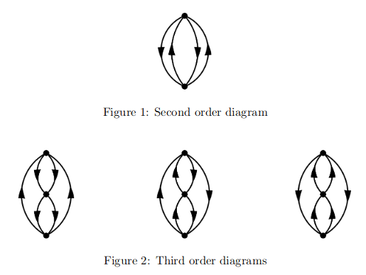

## Hugenholtz Diagrams

The perturbation series for the ground state energy can be given by diagrams in the Hugenholtz vein constructed according to the following rules 
For an *n*<sup>th</sup> order diagram, n dots (vertices) are drawn in a column. Thesvertices are connected by directed lines subject to the conditions
1. Each vertex has two lines pointing in and two pointing out.
2. Each diagram is connected, i.e.  one must be able to go from any one vertex to any other by following some number of lines.
3. No line connects a vertex with itself.
4. Each diagram is topologically distinct.



For order *n* there will be &half;*n*(*n*-1) pairs of nodes. So for order 2 there will be &half;2.1=1, and for 3 there will be &half;3.2=3 pairs as seen above.
```python
def nodalPairCount(order):
    #return the number of pairs of nodes in Hugenholtz diagrams of 'order'
  
    return 0.5 * order * (order- 1)
```   
For a diagram of order *n* there will be a total of 2*n* lines joining nodes in the diagram
```python
def nodalLineCount(order):
    #return the total number of line connecting nodes in the diagram
    
    return 2 * order
```
First generate a list of nodal pairs, we will number the nodes 0, 1, 2, ...
```python
def nodalPairs(order):
    #return number of nodal pairs in  diagram of 'order'
    
    pairs = []
    
    for p in range(order):
        for q in range(p+1, order):
            pairs.append([p, q])
            
    return pairs
```
We need a list of lists of all combinations of connection between the pairs. Each element of the list will be the number of nodal pairs long. We generate it by a recursive subroutine which initially takes a list of ones (diagram must be connected so no pair can have zero connections) nodal pairs long and a pair number 0 initially. So for order 3 it will take \[1,1,1] and 0. The routine then append to the initial list all possibilities on on the pair number ie \[1,1,1],\[2,1,1],\[3,1,1]. This list is then passed back to the routine with the pair number incremented, and so on until the pair number exceeds the number of nodal pairs. We can reduce the number of combinations by not allowing those where the sum of the connections exceeds the number of lines of the diagram order as any subsequent connections will still be above the limit.
```python
order = n
connections = [1] * r
nodePair = 0
pairCount = nodalPairs(order)

def nodalPairConnectionsCombinations(connections, nodePair, pairCount, order):
    #generate all combinations of connections between pairs
    
    #recursive return
    if nodePair == order: return connections
    
    #define maximum number of connections
    limit = 3
    
    #adjust for special case order 2
    if order == 2: limit += 1
    
    #make copy of connections as we are modifying it and don't want to processed appended elements
    c = connections.copy()
    
    #loop over all elements in original connection list
    for connection in connections:    
    
        #loop over all possible connection types, 
        for i in range(2, limit+1):

            #make copy of current connection
            t = connection.copy()
            t[nodePair] = i
            
            #if sum of elements is less than or equal to allowed lines in diagram save
            if sum(t) <= 2*order:
                c.append(t)
                
        #don't need original list now
        del connections
        
        #increment the nodePair
        nodePair += 1
                
        #recurse
        node = nodalPairConnectionCombination(c, nodePair, pairCount, order)
        
        return node
```
Now need to check that connection combinations are valid. There are two checks 1. That the total number of connections equals the number of lines (2.order) and 2. That the diagram is connected ie you can get from node 0 to node order-1 via all other nodes. The first pair is always 0->1 so then first connection is from node 1. *tested* is an array initially set to False values that are set to true when a nodal pair has contributed to the route (the first element is True as we essentially start at node 1).
```python
def verify(diagrams, order):
    #perform checks on diagrams for validity
    
    verified = []
    passed = False
    
    #get list of nodal pairs
    nodalPair = nodalPairs(order)
    
    #number of lines
    for d in diagrams:
    
        if sum(d) == nodalLineCount(order): 
        
          #check line count for diagram
          vertex = [0] * order
          
          #accummulate lines to each node
          for i in range(nodalPairCount(order)):
              vertex[nodalPair[i][0] += d[i]
              vertex[nodalPair[i][1] += d[i]
          
          #check correct number of lines at node
          if vertex == [4] * order:
          
              #number od lines at nodes verified check connected
              route = [0,1]
              node = 1
              tested = [False] * order
              tested[0] = True
          
              #loop over nodes to be found
              While True:
          
                #loop over nodal pairs
                for i in range(order):
            
                  pair = nodalPair[i]
              
                  #has pair been checked
                  if not tested[i]:
              
                      #is current node in nodal pair
                      current = -1
                      if node == pair[0]: current = 1
                      if node == pair[1]: current = 0
                  
                      #current node in nodal pair move to other node
                      if current >= 0:
                          route.append(pair[current])
                          node = pair[current]
                          tested[i] = True
                
                #all nodes tested leave while loop
                if all(t == True for t in tested): break
                
              #have we got all nodes, make unique and sort
              route = list(set(route))
              route.sort()
              passed = True
              for i in range(order);
                  if i != route[i]: passed = False

        verified.append(d)
        
     return verified
```
We have our valid diagrams. Next determine the number of up arrow lines. 
    

